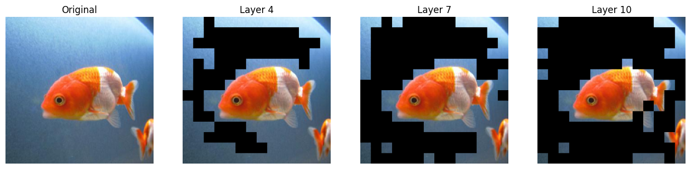

# Lab 6 - Transformer Pruning Report
  
1. **請說明 get_real_idx 實作部分是怎麼做的** 10%

    在 EViT 架構中，當第 $i$ 層進行 Pruning 後，所保留下來的 Token index (idxs[i]) 是相對於上一層輸出的位置，而非原始圖片的 Patch 位置。隨著層數加深，Token 數量不斷減少，index會發生偏移。為了在視覺化時將這些 Token 正確映射回原始圖片的像素區域，我們實作了 get_real_idx 函式。
    
    實作邏輯如下：
    
    1. 遞迴查表 (Recursive Lookup)：我們利用上一層已經還原回絕對位置的index表 (idxs[i-1]) 作為參照基準。
    2. index 對齊：由於 idxs[i] 是來自 Attention 層，包含了 CLS Token 的位移（Attention 中為了避開 CLS 做了 idx+1），而 idxs[i-1] 僅包含 Image Tokens。因此，在使用 idxs[i] 作為索引去查表前，我們先將其減 1，使其轉回 Image Token 的座標空間。
    3. 邊界處理 (Clamping)：考慮到 Fused Token 可能被選中（其索引位於序列最後），直接查表會導致越界。我們將 index 限制在合理範圍內，避免 CUDA 錯誤。
    4. Gather 操作：使用 torch.gather 函式，以「當前層的相對index」從「上一層的絕對index表」中取出數值。這樣一層一層傳遞下去，idxs[i] 就會變成指向最原始圖片 Patch 的絕對index。

2. **實際在哪些層做了 pruning ?** 10%

    根據程式碼中的 keep_rate 設定：

    keep_rate=(1, 1, 1, 0.7) + (1, 1, 0.7) + (1, 1, 0.7) + (1, 1)
    
    這是一個長度為 12 的 Tuple，對應 ViT 的 12 個 Block。keep_rate < 1 代表該層有進行 Pruning。

    實際執行 Pruning 的層數為：

    第 4 層 (Layer 4)：對應 index 3，Keep Rate = 0.7

    第 7 層 (Layer 7)：對應 index 6，Keep Rate = 0.7

    第 10 層 (Layer 10)：對應 index 9，Keep Rate = 0.7

    其餘層數的 Keep Rate 皆為 1，表示保留所有 Token，不進行修剪。
    
    
    
3. **如果沒有 get_real_idx 可視化結果會長怎樣，為什麼 ?** 10%

    如果沒有使用 get_real_idx 進行還原，直接使用模型輸出的 idx 進行視覺化，結果會呈現 「所有保留的 Patch 都錯誤地集中在圖片的左上角」，且與圖片內容完全無關。

    原因：

    index 意義不同：模型在深層輸出的索引是「相對 index」。例如，第 10 層保留了 60 個 Token，它們的索引值是 0, 1, 2...59。

    Patch 排列順序：在 mask 函式中，索引 0 對應圖片的最左上角 Patch，索引 1 是它右邊的 Patch，依此類推。

    錯誤的映射：如果直接拿第 10 層的索引 0~59 去畫圖，程式會以為我們要畫的是「原始圖片的前 60 個 Patch」，也就是圖片最上方的幾列。

    失去語意：我們將無法看到模型挑選物體的效果，因為原本代表金魚身體的相對索引（例如在縮減後的序列中排第 5 個），會被誤認為是原始圖片的第 5 個 Patch（背景）。
    
    
    
4. **分析視覺化的圖，這些變化代表著什麼 ?** 10%

    

    Layer 4 ：

    圖片中大部分的黑色區塊集中在背景（如水域），而金魚的主體被完整保留。

    模型在淺層就已經能利用 Attention 機制區分出「前景物件」與「背景雜訊」。Keep Rate 0.7 移除掉了 30% 對分類最不重要的資訊。

    Layer 7 ：

    背景被進一步大面積移除，黑色的區域變多。金魚的輪廓變得非常清晰，金魚邊緣的一些模糊背景也被修剪掉了。

    隨著網路加深，語意特徵變得更強。模型更加確信哪些區域屬於主體。

    Layer 10 ：

    只剩下金魚最核心的特徵部位（如魚頭、眼睛、魚鱗紋路），幾乎所有的背景都變成了黑色。

    模型不需要看完整的像素，只需要看到這些最具辨識度（Discriminative）的特徵 Patch，就能準確判斷這是金魚。

    Fused Token 的作用：雖然背景變黑了，但這些資訊並沒有憑空消失，而是被融合進了 Fused Token 中。這讓模型除了 Token 減少帶來的加速（FLOPs 降低），也能透過 Fused Token 保持對全局上下文的理解。
    
    
    