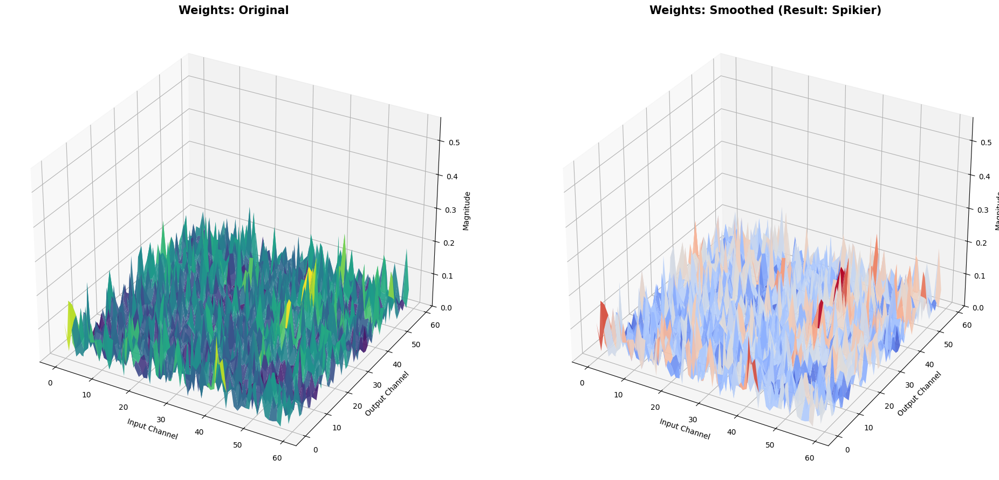
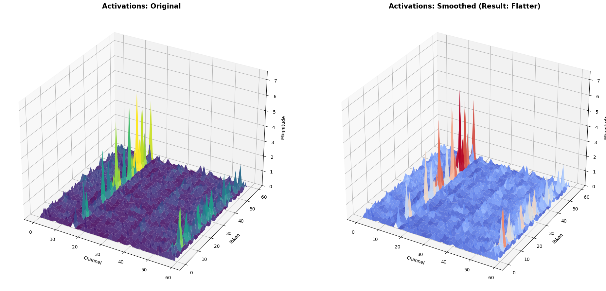

# Lab 6 - Transformer Quantization Report
  
1. **What's the difference between SmoothQuant and the method in Lab3?** 

    SmoothQuant 與 Lab 3 (PTQ, QAT) 最主要的差異在於對 Activation Outliers (極端值) 的處理方式以及量化精度的達成策略：
    1. 處理 Outlier 的機制：
    
        1. Lab 3 (PTQ)：通常採用直接的 Min-Max 或 Histogram 校正來決定 Scale。對於 Transformer 模型 (如 ViT)，Activation 常有極大的 Outlier，PTQ 為了包住 Outlier 會導致其他數值的解析度過低 (Scale 太大)，或者截斷 Outlier 導致精度大幅下降。
        2. SmoothQuant：引入了 Smoothing (平滑化) 機制。它利用數學轉換($Y = (X \text{diag}(s)^{-1}) \cdot (\text{diag}(s) W)$)，將 Activation 的量化難度 (Outliers) 轉移給 Weight。它把 Activation 的 Outlier 縮小 (除以 $s$)，同時把 Weight 放大 (乘以 $s$)，讓 Activation 變得平滑、容易量化。
    2. 量化配置：
        1. Lab 3：在 Transformer 模型上，由於 Activation 很難量化，通常只能做到 W8A16 (Weight INT8, Activation FP16) 才能維持精度，或者是需要高成本的 QAT (微調訓練)。
        2. SmoothQuant：成功實現了 W8A8 (Weight 和 Activation 都是 INT8) 的全整數量化，且不需要微調 (Training-free) 就能保持與 FP16 幾乎一致的精度，從而獲得更高的推論能力。

    

2. **When applying SmoothQuant, where do activation values get divided by the smooth factor?** 

    在使用 SmoothQuant 時，Activation 數值並不是在讀取 Activation 矩陣時才即時除以 $s$，而是透過修改前一層的參數來預先達成。
    具體來說，Activation ($X$) 通常是由前一層的 LayerNorm (或 Linear 層) 輸出的。SmoothQuant 直接修改了 LayerNorm 的權重 (Weight) 與偏差 (Bias)：
    
    1. 操作位置：LayerNorm 層 (Block 7 中的 smooth_ln_fcs 函式)。
    2. 操作方式：將 LayerNorm 的參數除以平滑因子 $s$。

    $$\text{LayerNorm.weight}_{\text{new}} = \frac{\text{LayerNorm.weight}_{\text{old}}}{s}$$

    $$\text{LayerNorm.bias}_{\text{new}} = \frac{\text{LayerNorm.bias}_{\text{old}}}{s}$$

    這樣一來，LayerNorm 輸出的結果自然就是已經縮小過的 $\hat{X} = X / s$，達到了平滑化的效果，讓後續的 Linear 層輸入 (Activation) 變得更容易量化。

   
    
    
    
3. **How is the smooth factor being calculated?** 

    Smooth Factor ($s$) 的計算目標是平衡 Activation ($X$) 與 Weight ($W$) 的量化難度。它是針對每一個 Input Channel ($j$) 獨立計算的。計算公式：$$s_j = \frac{\max(|X_j|)^\alpha}{\max(|W_j|)^{1-\alpha}}$$
    
    變數說明：
    1. $|X_j|$：第 $j$ 個 Input Channel 的 Activation 絕對值最大值 (由 Calibration 階段蒐集而來)。
    2. $|W_j|$：第 $j$ 個 Input Channel 對應的所有 Weight 的 絕對值最大值。
    3. $\alpha$ (Migration Strength)：控制搬移多少難度的超參數 (Hyperparameter)。
    
        通常 $\alpha = 0.5$，代表將量化難度平均分配給 Activation 和 Weight。
        
        若 $\alpha$ 越大，代表把越多 Activation 的難度轉移給 Weight (讓 Activation 更平滑)。

    
    
    
    
4. **What's the difference between ViT-S and CNN models when doing quantization?** 

    在進行量化時，ViT-S 與 CNN最大的差異在於 Activation 的Distribution：

    CNN：

    Activation 的數值分佈通常較為均勻 (Gaussian-like)，且 Outliers 較少或較隨機。

    因此，CNN 通常可以直接使用傳統的 PTQ 方法 (如 Min-Max) 進行 W8A8 量化，精度損失較小。

    ViT-S：

    嚴重的 Outlier 問題：Transformer 架構 (特別是 Attention 機制和 LayerNorm 後) 的 Activation 存在「系統性的極端值」。這些 Outlier 可能比正常數值大 100 倍以上，且通常固定出現在特定的 Channel 中。

    量化困難：如果直接做 INT8 量化，為了包容這些 Outlier，量化刻度 (Scale) 會被拉得很大，導致原本佔大多數的小數值通通變成 0，嚴重破壞模型精度。這就是為什麼 ViT 需要 SmoothQuant 這種特殊技術來處理 Outlier，而 CNN 比較不需要的原因。
    
    
5. **What's your observation on the visualization of weight and activation values distribution?**    

    
    

    可以觀察到 SmoothQuant 帶來的顯著變化：
    
    1. Activation的變化：

        1. Original：可以看到明顯的Spikes，某些特定 Channel 的數值遠大於其他 Channel，這就是導致量化困難的 Outliers。
        2. Smoothed：經過除以 $s$ 處理後，這些outlier被 Flattened 了。整體數值分佈變得更加平緩、均勻，數值範圍變小，這使得它非常適合進行 INT8 量化
        
    2. Weight的變化：
        
        1. Original：原始權重的分佈相對均勻和平坦。
        2. Smoothed：為了補償 Activation 的縮小，權重乘以了 $s$。因此，Smoothed Weight 的圖表會變得比較崎嶇，數值波動變大。但因為 Weight 是靜態的，且神經網路對 Weight 的量化誤差容忍度通常比 Activation 高，所以這種變化是可以接受的。