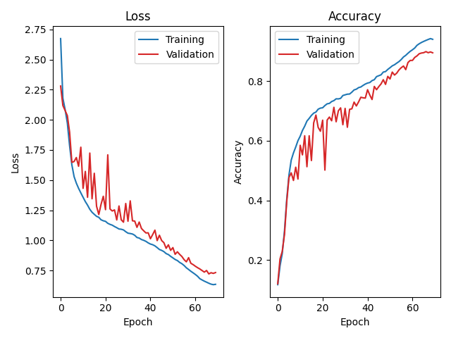

# Lab 3 Report Template

## 1. Model Architecture (10%)

* forward()部分：
    1. 在 QuantizableResNet 的 forward 方法中，我們在模型的最開頭插入了 self.quant = tq.QuantStub()，並在最末端（fc layer 之後）插入了 self.dequant = tq.DeQuantStub()
    2. 這些 Stubs 是用於標記量化的範圍，分標標記從哪邊開始要將 FP32 轉換為 INT8，哪邊要再轉換回去。
* fuse_model():
    1. 主要目的是將連續的 Conv, BN, ReLU 全部融合成一個單一的運算層，讓模型在 inference 的時候可以不用分三步去計算，可以一次完成
* Residual Connection():
    1. 在 QuantizableBottleneck 的 forward 中，我們沒有使用 out = F.relu(out + identity)，而是改用 self.skip_add_relu.add_relu(out, identity)。
    2. 這是因為加法的運算子無法被量化器正確地與 ReLU 融合。使用 nn.quantized.FloatFunctional() 提供的 add_relu 函式，是 PyTorch 官方指定的方法，以確保這個「相加並激活」的殘差操作也能被正確融合並量化。

## 2. Training and Validation Curves (10%)

* Provide plots of **training vs. validation loss** and **training vs. validation accuracy** for your best baseline model.
    
* Discuss whether overfitting occurs, and justify your observation with evidence from the curves.：
    
    如圖所示，訓練集損失 (Training Loss) 和驗證集損失 (Validation Loss) 都能穩定下降，且兩者之間的差距 (gap) 沒有明顯擴大。同時，驗證集準確率 (Validation Accuracy) 也能穩定提升至 90%。這證明在 60 個 epochs 內，weight_decay 和 AutoAugment 等正規化手段有效地抑制了過擬合。
## 3. Accuracy Tuning and Hyperparameter Selection (20%)

Explain the strategies you adopted to improve accuracy:

- **Data Preprocessing:** What augmentation or normalization techniques were applied? How did they impact model generalization?

    我們使用了 32x32 的輸入，並應用了 RandomCrop(32, padding=4)、RandomHorizontalFlip() 和 transforms.AutoAugment(AutoAugmentPolicy.CIFAR10)，原本有想說要和LAB1一樣調成224x224，但發現這樣會讓input變很大而且Colab會爆開，重新看一次助教給的資料才發現要固定32x32就好。另外 AutoAugment 是一種自動化的資料增強策略，它能組合出比手動調整更複雜、更有效的增強方式，是提升 CIFAR-10 準確率的關鍵技術，有助於模型學習到更泛化的特徵。
- **Hyperparameters:** List the chosen hyperparameters (learning rate, optimizer, scheduler, batch size, weight decay/momentum, etc.) and explain why they were selected.

    超參數的部分我們有試過不同的Epoch以及加上Labelsmoothing以後的效果，會在下方的表格呈現。另外我們選擇 weight_decay=5e-4（而不是較小的 1e-4），因為這對於 ResNet-50 這樣的深層網路在 CIFAR-10 這種小數據集上訓練時，是防止過擬合的關鍵正規化參數。我們使用 CosineAnnealingLR，它能讓學習率在訓練過程中平滑地從 0.1 降至 0，被證實比傳統的 MultiStepLR 更能幫助模型收斂到較好的局部最小值。

- **Ablation Study (Optional, +10% of this report):** Compare different hyperparameter settings systematically. Provide quantitative results showing how each parameter affects performance.

You may summarize your settings and results in a table for clarity:

| Hyperparameter | Loss Function | Optimizer | Scheduler | Weight Decay / Momentum | Epochs | Final Accuracy |
| -------------- | ------------- | --------- | --------- | ----------------------- | ------ | -------------- |
| Value          |     CrossEntropy          |   SGD        |     Cosine      |         5e-4/0.9                |    10    |       88.91%         |
| Value          |     CrossEntropy          |   SGD        |     Cosine      |         5e-4/0.9                |    50    |       92.58%         |
| Value          |     CrossEntropy (label smoothing = 0.1)         |   SGD        |     Cosine      |         5e-4/0.9                |    60    |       93.96%         |

## 4. Custom QConfig Implementation (25%)

Detail how your customized quantization configuration is designed and implemented:

1. **Scale and Zero-Point:** Explain the mathematical formulation for calculating scale and zero-point in uniform quantization.

    1. 在均勻量化 (Uniform Quantization) 中，我們將 32 位元浮點數 (real value, $r$) 映射到 8 位元整數 (quantized value, $q$)。
    2. 量化 (Quantization)：$q = \text{clip}(\lfloor \frac{r}{s} \rceil + z, q_{\text{min}}, q_{\text{max}})$
    3. 反量化 (Dequantization)：$r \approx s(q - z)$
    4. 其中 $s$ 是縮放因子 (scale)，代表 INT8 每增加 1 對應到 FP32 的變化量。$z$ 是零點 (zero-point)，代表 FP32 的 0 對應到的 INT8 整數值。

2. **CustomQConfig Approximation:** Describe how the `scale_approximate()` function in `CusQuantObserver` is implemented. Why is it useful?

    1. 在 CusQuantObserver 中，我們建立了 scale_approximate() 函式。
    2. 此函式接收一個浮點數 scale，並將其近似為最接近的 2 的負整數次方 ($2^{-S}$)。
    3. 主要流程：
        1. 透過 $S \approx -\log_2(scale)$ 來估算出所需的位移量 $S$。
        2. 將 $S$ 四捨五入 (round) 到最接近的整數。
        3. 將 $S$ 限制 (clamp) 在 [0, max_shift_amount=8] 的範圍內。
        4. 返回 $2^{-S}$ 作為新的 scale。
    4. 因為在真實硬體上，執行浮點數乘法 (x * scale) 非常昂貴且耗能。而執行整數位移 (x >> S) 則非常快且成本極低。scale 能讓硬體可以用一個快速的位元右移 (Bitwise Right Shift) 來取代昂貴的浮點數乘法，從而實現硬體加速。
3. **Overflow Considerations:** Discuss whether overflow can occur when implementing `scale_approximate()` and how to prevent or mitigate it.

    1. 在scale_approximate() 中，我們將位移量 S 限制在 max_shift_amount=8 以內。
    2. 若我們不設定上限，當 scale 非常非常小（例如 $10^{-10}$）時，S 會變得非常大（例如 $S \approx 33$）。
    3. 如果 S 過大（例如 33），new_scale = 2**(-33) 會是一個極小的數字，這會導致下溢 (Underflow)，所有數據在量化後都變成了 0，模型的精度會瞬間崩潰。因此，將 S 限制在 8（或一個合理的範圍內）是為了在硬體加速和維持數值精度之間取得平衡，防止因位移量過大而導致的精度災難。

## 5. Comparison of Quantization Schemes (25%)

Provide a structured comparison between **FP32, PTQ, and QAT**:

- **Model Size:** Compare file sizes of FP32 vs. quantized models.
- **Accuracy:** Report top-1 accuracy before and after quantization.
- **Accuracy Drop:** Quantify the difference relative to the FP32 baseline.
- **Trade-off Analysis:** Fill up the form below.

| Model   | Size (MB) | Accuracy (%) | Accuracy Drop (%) |
|---------|-----------|--------------|-------------------|
| FP32    |     94.41      |       93.96       |         0          |
| PTQ     |      23.66     |        92.99      |         0.01          |
| QAT     |      24.12     |       93.97       |         -0.0001          |

## 6. Discussion and Conclusion (10%)

- Did QAT outperform PTQ as expected?
    
    QAT (93.97%) 的準確率優於 PTQ (92.99%)。但是PTQ準確率只有從 93.96% 下降到 92.99%，損失不到 1%，在Size上卻可以減少許多。這證明了對於 ResNet-50 這個模型，CusQuantObserver 是一個非常高效且準確的量化策略。而 QAT 不僅成功補足了 PTQ 損失的 1% 準確率，甚至還超越了原始的 FP32 基準 (93.97% vs 93.96%)。這也能證明 QAT Finetuning 不僅能讓模型適應量化誤差，也能幫助模型收斂到一個比原始 FP32 訓練robust的最佳解。
- What challenges did you face in training or quantization, and how did you address them?
    
    在這次作業中，我遇到了幾個點：

    1. 嚴重的 CUDA Out of Memory (OOM) 錯誤：在初次訓練 FP32 模型時，即使 BATCH_SIZE 降到 8，GPU 記憶體依然會耗盡。這部分就是前面所提到在做 data augmentation時的錯誤。

    2. 對 ResNet-50 輸入尺寸的誤解：OOM 錯誤的根源是我錯誤地將 CIFAR-10 圖片 transforms 到 224x224。我的錯誤假設是 ResNet-50 必須使用 ImageNet 的 224x224 輸入。

    3. 架構分析與解決：後來我意識到，助教提供的 QuantizableResNet 架構是專為 32x32 輸入設計的 CIFAR-10 修改版（例如 conv1 的 stride=1 且沒有 MaxPool）。強行輸入 224x224 圖片會導致中間特徵圖的尺寸異常巨大，從而耗盡 VRAM。將 transforms 改回 32x32 的 RandomCrop 後，OOM 問題立刻解決，模型準確率也達到了 93.96% 的高水準。

    4. QAT Runtime 錯誤：在實作 QAT 時，遇到了兩個錯誤：

        Fusion only for eval!：這提醒了我 fuse_model() 必須在 model.eval() 模式下執行。

        device mismatch (cpu vs. cuda)：prepare_qat() 會在 CPU 上新增模組，必須在之後手動呼叫 model.to(device) 才能將模型移回 GPU 進行訓練。
- Any feedbacks for Lab3 Quantization?

    這次作業和前面比起來有更難。Lab 3 讓我深刻理解了模型量化在「模型大小」、「推論速度」和「準確性」之間的權衡。

    CusQuantObserver 的實作讓我去思考 scale 和 zero-point 在真實硬體（例如 x >> S 位移）中是如何被近似和優化的。從結果來看，這個策略非常成功，PTQ 的準確率僅下降了不到 1%。
    
    而最大的收穫是解決 OOM 錯誤的過程：它迫使我必須去深入理解模型架構與輸入尺寸之間的絕對關聯（32x32 vs 224x224），而不只是盲目地使用預設參數。
